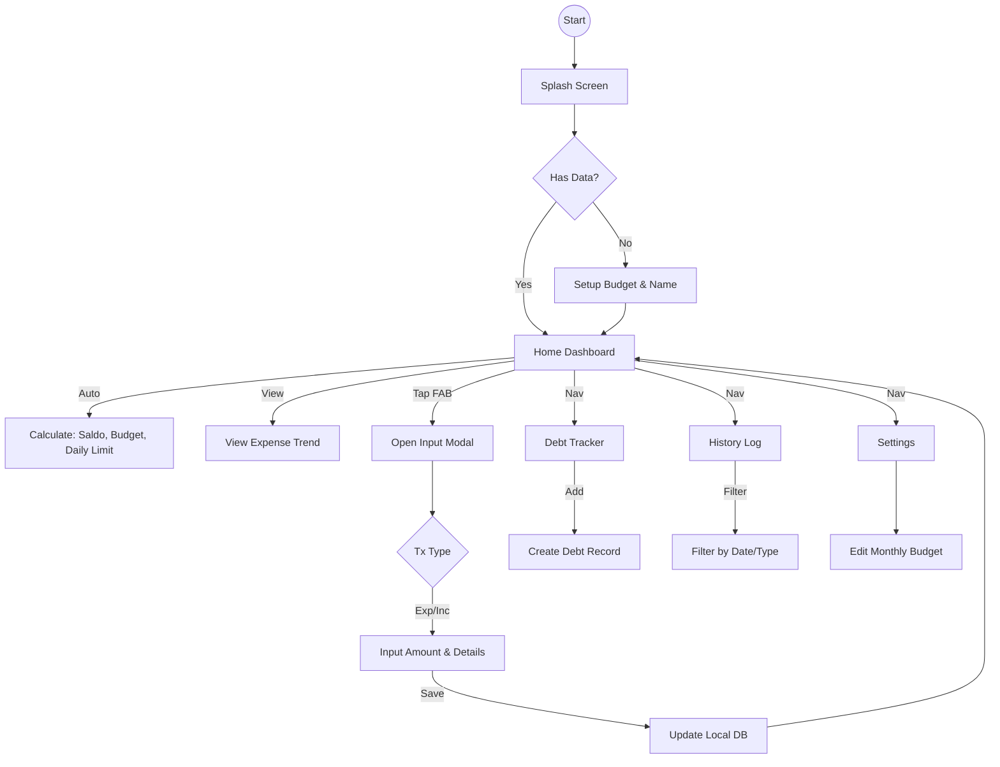

# Frontend Engineering Design - Dompetku (iOS Portrait)

Dokumen ini adalah spesifikasi teknis dan desain final untuk pengembangan aplikasi Dompetku. Dokumen ini mencakup prinsip UI/UX, arsitektur teknis, spesifikasi fitur, wireframe, dan model data.

## 1. Prinsip Desain UI/UX
*   **Platform Target:** iOS (Optimized for iPhone 13/14/15 dimensions).
*   **Visual Style:** Clean, Minimalist, Native iOS feel (Human Interface Guidelines).
*   **Ergonomi:** "Thumb-zone friendly" (elemen interaktif utama berada di bagian bawah layar).
*   **Responsivitas:** Mendukung Dark Mode & Light Mode (System Default).

## 2. Arsitektur Teknis (Recommended Stack)
*   **Framework:** React Native (Expo SDK 50+) - untuk pengembangan cepat dan performa native.
*   **Language:** TypeScript - untuk keamanan tipe data (Type Safety).
*   **State Management:** Zustand (Ringan & Cepat) atau React Context.
*   **Local Storage:** MMKV (High performance storage) untuk menyimpan data transaksi/setting secara lokal (Offline First).
*   **Navigation:** Expo Router (File-based routing) atau React Navigation 6.
*   **UI Component:** NativeWind (TailwindCSS for React Native) atau Restyle.

## 3. Design System Token

### A. Color Palette (Premium Dark Green Glassmorphism)
*   **Background:** `#020906` (Deepest Forest Green) - Latar belakang utama (Hampir hitam).
*   **Surface (Glass):** `rgba(10, 35, 25, 0.7)` dengan Blur 20px - Untuk kartu, modal, dan bottom bar.
*   **Primary (Brand):** `#10B981` (Emerald 500) - Aksen utama, tombol aktif, gradient start.
*   **Secondary (Gold/Accent):** `#D4AF37` (Metallic Gold) - Opsional untuk highlight premium.
*   **Success (Income):** `#34D399` (Emerald 400) - Indikator positif yang menyatu dengan tema.
*   **Danger (Expense):** `#FB7185` (Rose 400) - Merah pastel yang elegan di latar gelap.
*   **Text Main:** `#FFFFFF` (White) - Keterbacaan maksimal.
*   **Text Muted:** `#A7F3D0` (Pale Emerald) - Teks sekunder/caption.

### B. Typography
*   **Font Family:** San Francisco (System Font).
*   **Sizes:**
    *   Header (Saldo): 34pt (Bold).
    *   Title: 22pt (SemiBold).
    *   Body: 17pt (Regular).
    *   Caption: 13pt (Regular/Gray).

---

## 4. Struktur Navigasi & Layout

### A. Top Header
*   **Total Saldo:** Ditampilkan dominan. Format mata uang: `Rp 5.250.000`.
*   **Global Budget Bar:** Progress bar linear di bawah saldo.
    *   *Logic:* `(Total Expense / Monthly Budget) * 100`.
    *   *Color:* Green (<75%), Yellow (75-90%), Red (>90%).

### B. Body (Dashboard Content)
*   **Expense Trend:** Line Chart (Victory Native / React Native Chart Kit) menampilkan 7 hari terakhir.
*   **Recent Activity:** List 5 transaksi terakhir.
*   **Summary Cards:** Ringkasan kecil "Hutang vs Piutang".

### C. Floating Action Button (FAB)
*   Posisi: Bottom Center (Overlay).
*   Action: Membuka Modal Input (Slide up / Fade in).

### D. Bottom Navigation
1.  **Home:** Dashboard.
2.  **History:** Log Transaksi.
3.  **Debt:** Manajemen Hutang.
4.  **Settings:** Profil & Konfigurasi.

---

## 5. Rincian Fitur Inti (Core Logic)

### A. One-Tap Transaction Input (Modal)
*   **Komponen:**
    *   **Type Switcher:** Segmented Control (Expense | Income).
    *   **Amount Input:** Custom Numeric Keypad (Tanpa keyboard sistem OS).
    *   **Timestamp:** Otomatis set ke `Date.now()` saat modal dibuka. User bisa override via DatePicker.
    *   **Category:** Dropdown/Chip sederhana (Makan, Transport, dll).
*   **Validation:** Amount > 0.

### B. Daily Spending Limit (Smart Insight)
*   **Logic:**
    ```typescript
    const today = new Date();
    const daysInMonth = getDaysInMonth(today);
    const remainingDays = daysInMonth - today.getDate() + 1;
    const remainingBudget = monthlyBudget - currentMonthExpenses;
    const dailyLimit = remainingBudget / remainingDays;
    ```
*   **Display:** "Safe to spend: Rp [dailyLimit] today".

### C. Debt Tracker
*   **Logic:** Mencatat hutang terpisah dari saldo utama (opsional: bisa mengurangi/menambah saldo saat dibuat).
*   **Sorting:** Berdasarkan Tanggal Jatuh Tempo terdekat.

---

## 6. Data Models (TypeScript Interfaces)

```typescript
// Transaksi
interface Transaction {
  id: string; // UUID
  type: 'EXPENSE' | 'INCOME';
  amount: number;
  category: string;
  note?: string;
  timestamp: number; // Unix Timestamp (menyimpan Date & Time)
  createdAt: number;
}

// Hutang/Piutang
interface DebtRecord {
  id: string;
  type: 'DEBT' (Hutang) | 'RECEIVABLE' (Piutang);
  personName: string;
  amount: number;
  dueDate?: number; // Optional timestamp
  isPaid: boolean;
  notes?: string;
}

// User Settings
interface UserSettings {
  monthlyBudget: number;
  userName: string;
  currency: string; // 'IDR'
  theme: 'light' | 'dark' | 'system';
}
```

---

## 7. Visualisasi Wireframe (ASCII)

### Home Screen
```
+--------------------------------+
|  9:41                      [=] |
|                                |
|   Total Saldo                  |
|   Rp 5.250.000                 |
|   [=================----] 85%  |
|   Sisa hari ini: Rp 45.000     |
|                                |
|   [Expense Trend 7 Days]       |
|       .       .                |
|      / \     /                 |
|     .   \   .                  |
|          \ /                   |
|           .                    |
|                                |
|   [Recent Activity]            |
|   - Makan Siang     -25.000    |
|     Senin, 12:30               |
|   - Ojek Online     -15.000    |
|     Senin, 09:15               |
|   - Gaji Bulan Ini  +5.000.000 |
|     Minggu, 08:00              |
|                                |
|             [ + ]              |
| [Home] [Hist] [Debt] [Sett]    |
+--------------------------------+
```

### Input Transaction Modal (Overlay)
```
+--------------------------------+
|  (Background Dimmed)           |
|                                |
|    +----------------------+    |
|    |  Input Baru          |    |
|    | [EXPENSE] / INCOME   |    |
|    |                      |    |
|    |     Rp 15.000        |    |
|    | [Ket. Opsional]      |    |
|    | [Today 12:30] [Food] |    |
|    |                      |    |
|    | [1][2][3]            |    |
|    | [4][5][6]            |    |
|    | [7][8][9]            |    |
|    | [.][0][<]            |    |
|    |      [SIMPAN]        |    |
|    +----------------------+    |
|                                |
| [Home] [Hist] [Debt] [Sett]    |
+--------------------------------+
```

### History Screen
```
+--------------------------------+
|  History                   [Y] |
|  [ All ] [ Income ] [ Expense ]|
|                                |
|  Today, 25 Oct                 |
|  - Makan Siang        -25.000  |
|    12:30 WIB                   |
|  - Ojek Online        -15.000  |
|    09:15 WIB                   |
|                                |
|  Yesterday, 24 Oct             |
|  - Gaji              +5.000.000|
|    17:00 WIB                   |
|                                |
|             [ + ]              |
| [Home] [Hist] [Debt] [Sett]    |
+--------------------------------+
```

---

## 8. Alur Pengguna (Mermaid Flowchart)



---

## 9. Verifikasi & Konfirmasi

**Status Dokumen:** FINAL & APPROVED
**Tanggal Audit:** 2026-02-05

**Checklist Audit:**
*   [x] **UI/UX Consistency:** Layout iOS Portrait valid.
*   [x] **Feature Completeness:** One-tap input, Global Budget, Debt Tracker, History, Settings tercakup.
*   [x] **Technical Detail:** Stack (React Native + TS), Data Models, dan Logic sudah didefinisikan.
*   [x] **Real-time Requirement:** Timestamp (Hari, Tanggal, Jam) sudah ditambahkan.
*   [x] **Visualization:** ASCII Wireframes & Flowchart lengkap dan konsisten.

Dokumen ini siap digunakan sebagai acuan utama (Blueprint) untuk fase implementasi (Coding).
